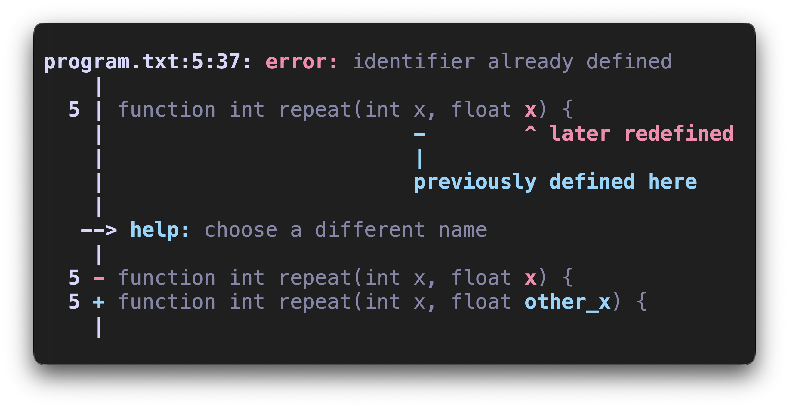
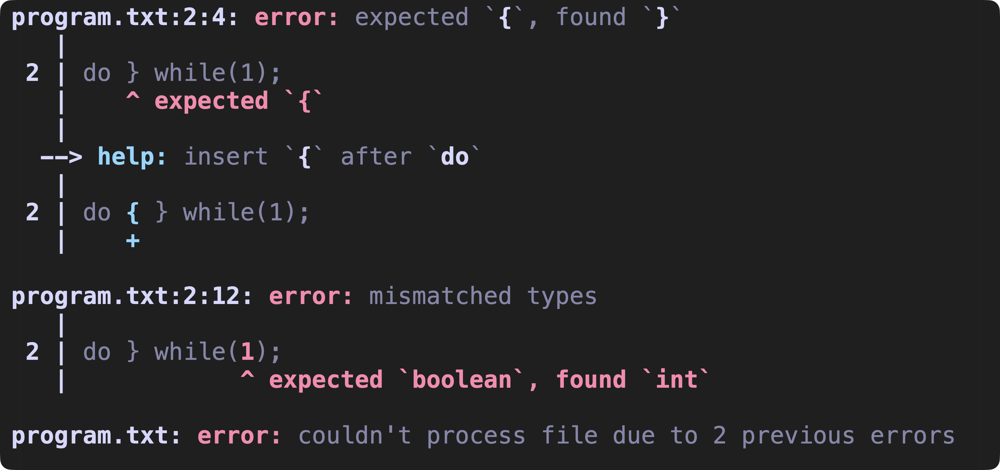
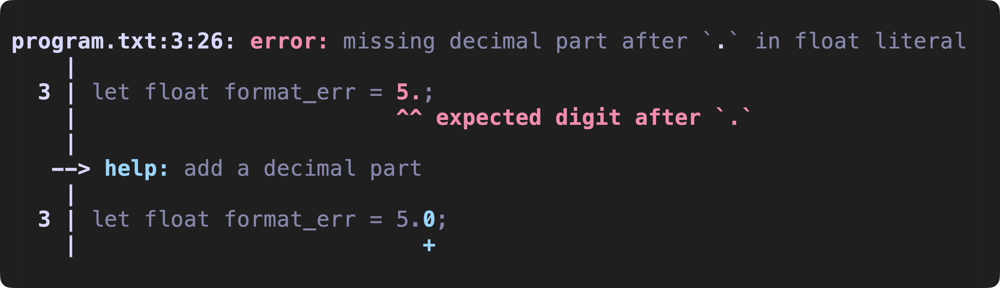
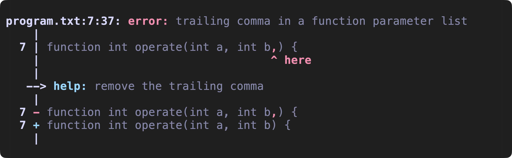
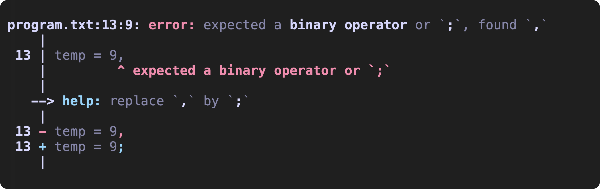

# jsp

A modular and highly efficient language processor for *MyJS* (a custom scripting language), featuring robust recovery, rich diagnostics and optional per-module trace output for debugging and analysis.



## Table of Contents
- [Features](#features)
- [How to use](#how-to-use)
- [Installation](#installation)

## Features

### Error recovery

The compiler includes error recovery across the lexer, parser, and semantic analysis to report as many diagnostics as possible in a single run. The lexer may emit placeholder tokens to keep parsing coherent, while the LR(1) parser attempts minimal-cost fixes (insert/delete/replace) to resynchronize. Semantic analysis propagates an error type to avoid cascaded noise and only reports reliable errors.



### Fix suggestions

Each module can generate fix suggestions for certain errors, indicating how to insert, delete, or replace code to resolve the issue. These hints show possible minimal changes that correct the detected problem. There are three types:

- Insertion hints
    
- Deletion hints
    
- Replacement hints
    

## How to use

To get an overview of all available options run `jsp -h` or `jsp --help`.

### Basic use

To process one or more files just run `jsp <FILE> [<FILE> [...]]`
Every file will be processed even if some of them generate errors.

Add the `--quiet` or `-q` to discard the output if you only need the return value.

### Showing traces

You can inspect what each stage of the processing generates by enabling one or more trace flags:

`--lexer-trace [<FILE>]` or `-l [<FILE>]` — dump the generated tokens

`--parse-trace [<FILE>]` or `-p [<FILE>]` — dump the parser output / grammar trace

`--symtb-trace [<FILE>]` or `-s [<FILE>]` — dump the generated symbol table

Each trace is written to the given file. If no file is provided, it prints to `stdout`.

## Installation

### Requirements
You need an installation of [Rust](https://www.rust-lang.org/tools/install).

### Build from source
To generate the binary run on your terminal:
```bash
git clone https://github.com/suuniqo/jsp.git
cd jsp
cargo build --release
